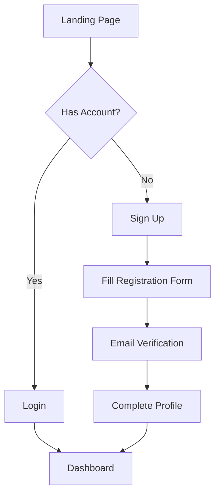
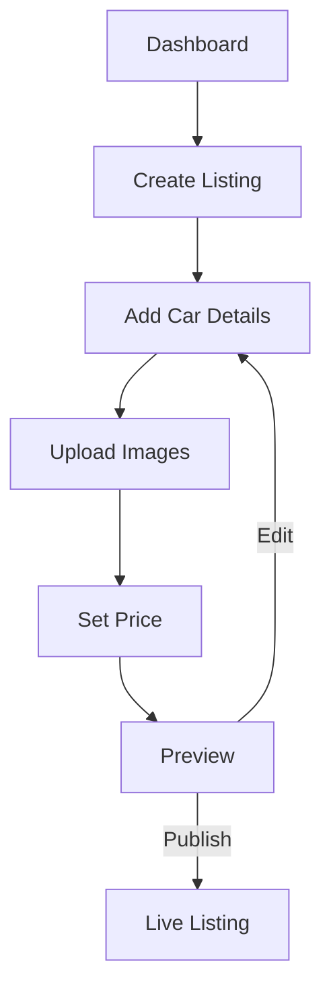
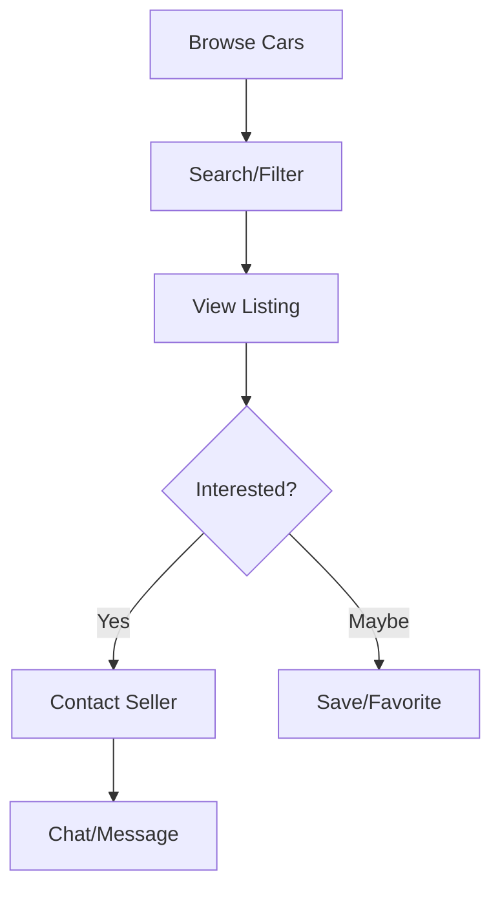
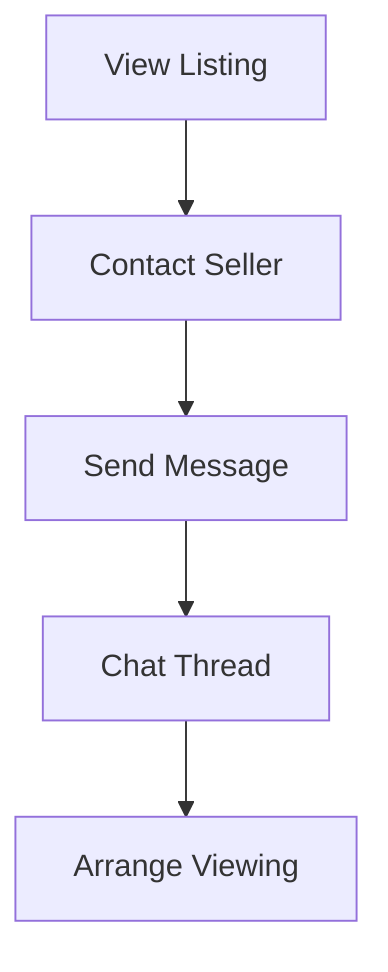
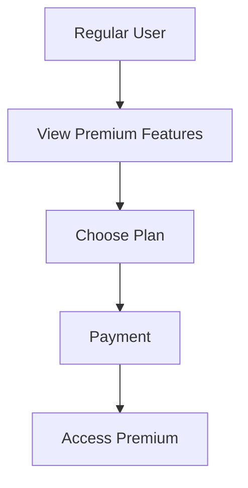
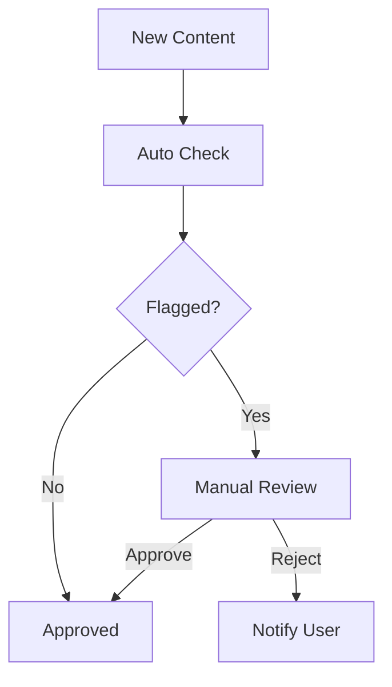

# NCP Wheels V2 - User Flow Documentation

## 1. User Registration and Authentication

### Guest User

### Authentication Flow
1. User visits website
2. Chooses to register or login
3. Completes required steps
4. Redirected to dashboard

## 2. Car Listing Management

### Seller Flow

### Buyer Flow

## 3. Search and Discovery

### Search Flow
1. Enter search criteria
2. Apply filters
   - Price range
   - Make/Model
   - Year
   - Location
3. View results
4. Refine search

### Advanced Features
- Save searches
- Set alerts
- Compare cars
- View history

## 4. Communication

### Messaging Flow

## 5. Transaction Process

### Buying Process
1. Find car
2. Contact seller
3. Negotiate price
4. Arrange inspection
5. Complete purchase

### Selling Process
1. Create listing
2. Respond to inquiries
3. Show car
4. Negotiate
5. Complete sale

## 6. Premium Features

### Premium User Flow

## 7. Admin Operations

### Moderation Flow

